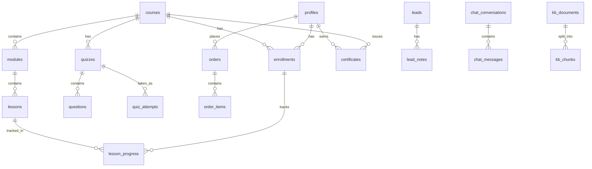

# 04 — Database Schema

The runnable version is `supabase/migrations/0001_init.sql`. This file explains it.

## Entity map

## Tables
| Table | Purpose | Key columns |
|---|---|---|
| profiles | One per auth user | id (=auth.users.id), full_name, certificate_name, role, country, phone |
| categories | Course & blog categories | slug, name, type |
| courses | Course catalog | slug, title, summary, level, price_usd, price_pkr, access_months, status, instructor_id |
| modules | Course sections | course_id, title, position |
| lessons | Units of learning | module_id, type, title, bunny_video_id, duration_sec, content_md, is_preview, unlock_rule |
| lesson_resources | Downloads | lesson_id, storage_path, label |
| enrollments | Access grants | user_id, course_id, source, starts_at, expires_at, status |
| lesson_progress | Per-lesson progress | enrollment_id, lesson_id, position_sec, completed_at |
| quizzes | Quiz or mock exam | course_id, lesson_id?, kind (quiz/exam), time_limit_min, pass_pct, attempts_allowed, randomize |
| questions | Question bank | quiz_id, type, prompt, options jsonb, correct jsonb, explanation, tag |
| quiz_attempts | Attempts | quiz_id, user_id, answers jsonb, score_pct, passed, started_at, submitted_at |
| orders | Purchases | user_id, status, currency, total, provider, provider_ref, proof_path |
| order_items | Lines | order_id, course_id, bundle_id, price |
| coupons | Discounts | code, kind, value, max_uses, used, expires_at |
| bundles / bundle_courses | Course packs | |
| certificates | Issued certs | code (unique), user_id, course_id, issued_at, pdf_path, status |
| leads | Service & course enquiries | source, name, email, phone, practice_name, specialty, interest, status, assigned_to |
| lead_notes | CRM notes | lead_id, author_id, body |
| posts | Blog | slug, title, body_md, seo jsonb, status, published_at |
| pages | Editable CMS blocks | slug, blocks jsonb |
| testimonials, faqs | Site content | |
| kb_documents / kb_chunks | Chatbot knowledge | chunks have embedding vector(1536) |
| chat_conversations / chat_messages | Chat logs (web + WhatsApp) | channel, wa_id, handoff, lead_id |
| lesson_questions / lesson_answers | Q&A | |
| notifications | In-app notifications | |
| audit_log | Admin actions | actor_id, action, entity, entity_id, diff |
| settings | Key-value site settings | |

## RLS policy plan
| Table | Student | Instructor | Admin | Anon |
|---|---|---|---|---|
| courses (published) | read | read + write own | all | read |
| lessons | read if enrolled or is_preview | write own courses | all | preview only |
| enrollments | read own | read for own courses | all | – |
| lesson_progress | read/write own | read own courses | all | – |
| quiz_attempts | read/write own | read own courses | all | – |
| questions.correct | never directly — graded by server function | own courses | all | – |
| orders | read own, insert own | – | all | – |
| certificates | read own | read own courses | all | via `verify_certificate()` RPC only |
| leads | – | – | all (sales role: all) | insert via server action only |
| chat_* | – | – | all | server only |

Helper: `public.current_role()` returns the caller's role from `profiles`; `public.is_admin()`; `public.is_enrolled(course_id)`.
